<div align="center">
  
</div>

> **2024.04.08 ~ 2024.05.20**

- 자율프로젝트(기업연계)

## ✅ 프로젝트 소개

- 구내식당 / 카페 이용내역(사원증 Tag) 확인용 모바일 App 개발

▪️ **기획의도 및 배경**

[문제제기]

- 당사 임직원은 사내에서 사원증 Tag를 통해 사내 카페테리아에서 음료/식사 비용 등을 결제하고 있음

- 각 사업자가 한 달 치 임직원 사용실적을 취합해 엑셀 형태로 당사 총무 부서에 전달 -> 담당자 내용 검토 -> 급여시스템 일괄등록 -> 사용 금액에 대해 차월 월급에서 차감하는 형태로 월급 명세서에는 사용금액 총계만 표기되는 상태이다.

- 임직원은 실시간 사용 내역을 확인하기 어려운 문제가 발생

[솔루션 도출]

- 결제를 할 때 마다 실시간으로 알림도 오고 사용한 내역을 기록 해주는 앱을 개발해보자 !

▪️ **서비스 목적**

- 사내 임직원들의 편의 향상

▪️ **기대효과**

- 편의성 향상
- 나의 지원금 파악 가능

## ✅ 개발 환경

### ⚙ Management Tool

- 형상 관리 : Gitlab
- 이슈 관리 : Jira
- 커뮤니케이션 : Mattermost, Webex, Notion, Discord
- 디자인 : Figma, PowerPoint

### 💻 IDE

- Visual Studio Code `1.18.5`
- IntelliJ IDEA community `2023.3.2`

### 📱 Frontend

- React `18.2.0`
- Typescript `5.2.2`
- Zustand `4.5.2`
- Axios `1.6.7`
- Websocket `1.0.34`
- firebase `10.11.1`
- stompjs `7.0.0`
- sockjs-client `1.5.4`

### 💾 Backend

- Springboot `3.22`
- Spring Data JPA
- MySql 8.0.34

### Infra

- AWS S3
- AWS EC2
- Nginx 1.18.0
- Docker: 25.0.3
  - mysql: 8.3.0
- Ubuntu 20.04.6 LTS

## ✅ 서비스 소개

- 저희 프로젝트는 서비스가 앱, 키오스크, 관리자 3가지로 나뉘어져 있습니다.

## 1. 앱 서비스

### 앱 로그인

<table>    
    <tr align="center" > 
        <td><strong>로그인</strong></td>
    </tr>
    <tr align="center"> 
        <td> 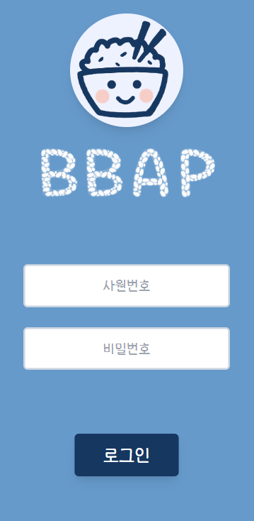 </td>
    </tr>
    <tr> 
        <td>
            1. 앱 로그인
        </td>
</table>

### 식당 화면

<table>    
    <tr align="center" > 
        <td><strong>식당</strong></td>
    </tr>
    <tr align="center"> 
        <td> 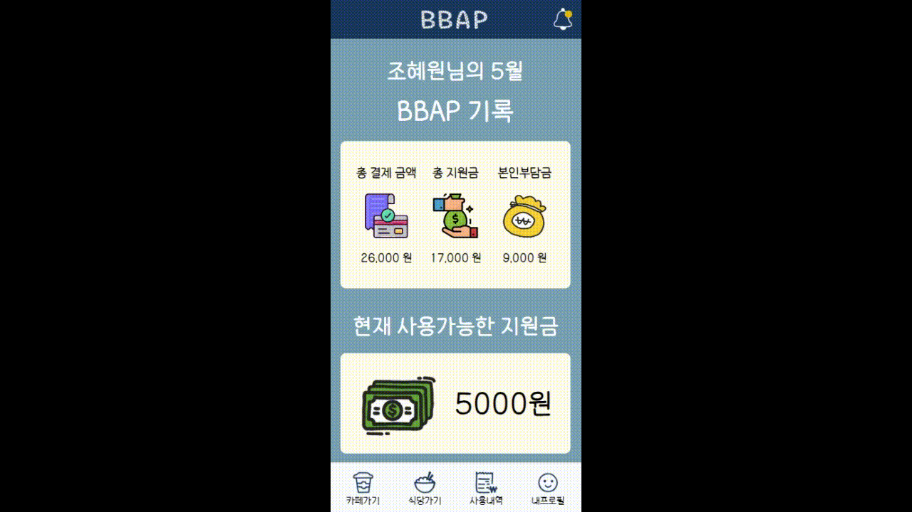 </td>
    </tr>
    <tr> 
        <td>
            1. 포스웰 사이트 크롤링을 통해 포스코 그룹 전체 식당의 메뉴를 볼 수 있음
        </td>
</table>

### 카페 화면

<table>    
    <tr align="center" > 
        <td><strong>혼자 주문</strong></td>
    </tr>
    <tr align="center"> 
        <td> 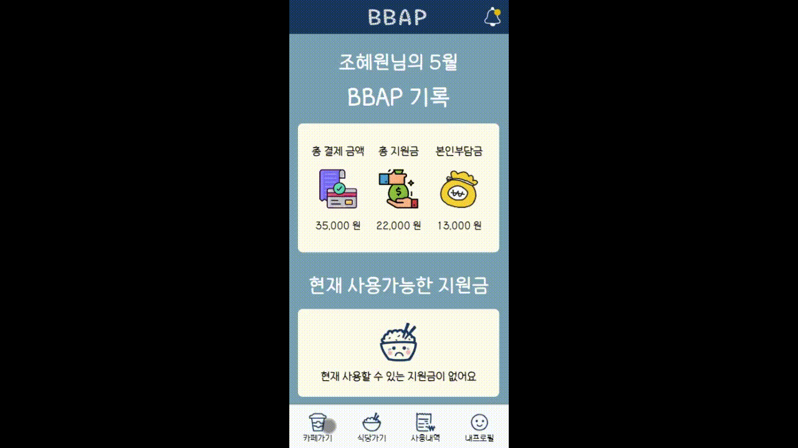 </td>
    </tr>
    <tr> 
        <td>
            1. 앱으로 카페 오더를 진행 할 수 있다.<br>
            1. 결제가 완료되면 알림이 온다.
        </td>
</table>

<table>    
    <tr align="center" > 
        <td><strong>같이 주문</strong></td>
    </tr>
    <tr align="center"> 
        <td> 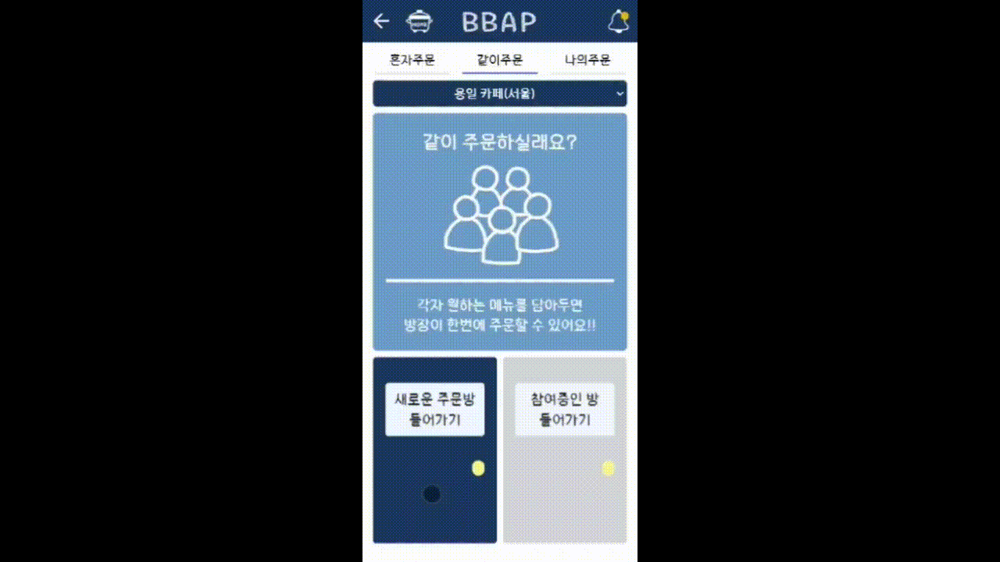 </td>
    </tr>
    <tr> 
        <td>
            1. 팀원들과 동시에 주문 할 수 있다.<br>
            2. 내기를 통해 한 사람이 결제 할 수 있다.<br>
            3. 내기결과와 결제 완료 알림이 온다.
        </td>
</table>

#### 3. 나의 주문

<table>    
    <tr align="center" > 
        <td><strong>나의 주문</strong></td>
    </tr>
    <tr align="center"> 
        <td> 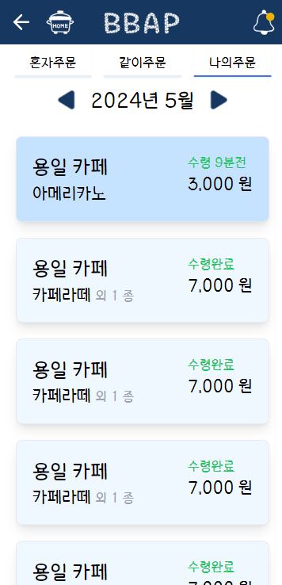 </td>
    </tr>
    <tr> 
        <td>
            1. 오더나 키오스크를 통해 주문한 내역을 확인 할 수 있다.<br>
        </td>
</table>

### 사용내역 화면

<table>    
    <tr align="center" > 
        <td><strong>사용 내역</strong></td>
    </tr>
    <tr align="center"> 
        <td>  </td>
    </tr>
    <tr> 
        <td>
            1. 해당 월의 본인 부담금, 지원금, 총 결제 금액을 한눈에 볼 수 있다. <br>
            2. 날을 선택하여 상세보기 또한 볼 수 있다. <br>
        </td>
</table>

### 내 프로필 화면

<table>    
    <tr align="center" > 
        <td><strong>내 프로필</strong></td>
    </tr>
    <tr align="center"> 
        <td> 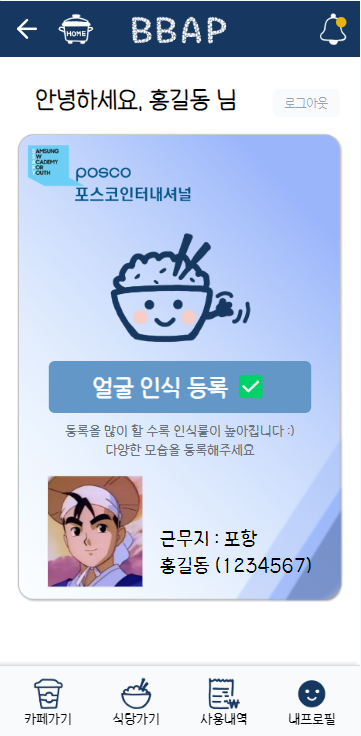 </td>
    </tr>
    <tr> 
        <td>
            1. 나의 사번, 근무지 확인 할 수 있다 <br>
            2. 얼굴 인식 등록을 할 수 있다.
        </td>
</table>

## 2. 관리자 서비스

<table>    
    <tr align="center" > 
        <td><strong>관리자 로그인</strong></td>
    </tr>
    <tr align="center"> 
        <td> 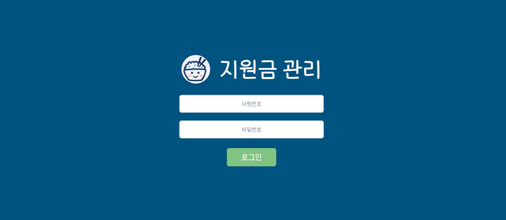 </td>
    </tr>
    <tr> 
        <td>
            1. 관리자 로그인
        </td>
</table>

<table>    
    <tr align="center" > 
        <td><strong>직원 확인</strong></td>
        <td><strong>직원 승인</strong></td>
    </tr>
    <tr align="center"> 
        <td> 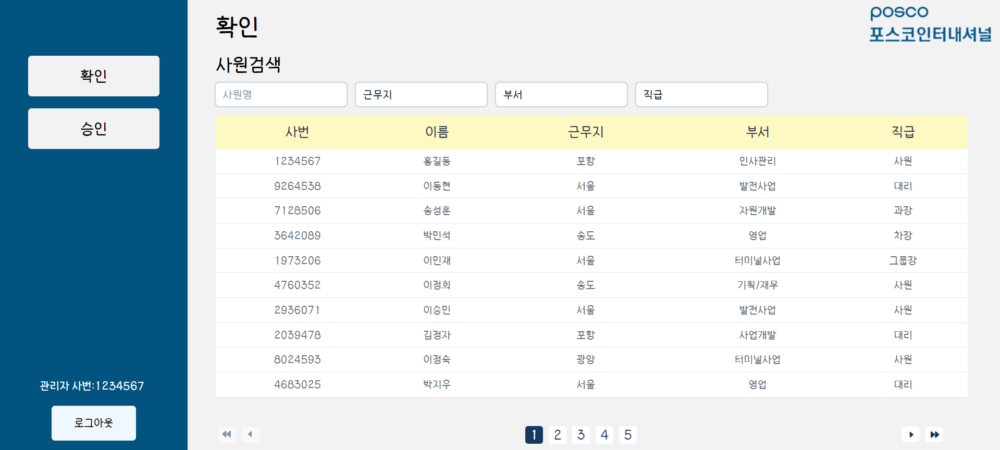 </td>
        <td> 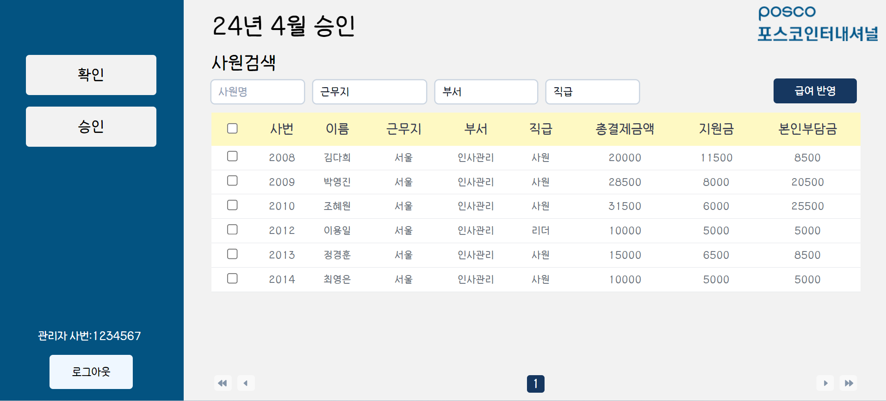 </td>
    </tr>
    <tr> 
        <td>
            1. 임직원의 정보를 확인 할 수 있다.
        </td>
        <td>
            1. 전월 사용내역을 급여 명세서에 반영 할 수 있다.
        </td>
</table>

## 3. 키오스크 서비스

<table>    
    <tr align="center" >
        <td><strong>키오스크</strong></td>
    </tr>
    <tr align="center"> 
        <td> 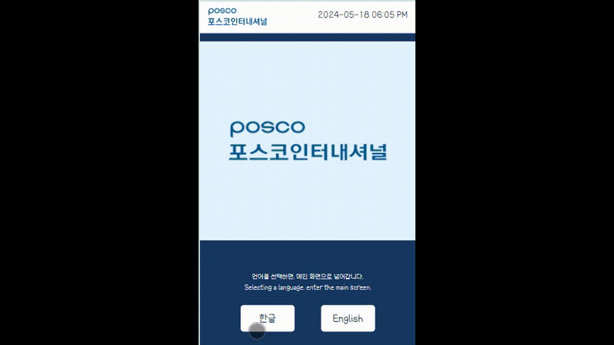 </td>
    </tr>
    <tr> 
        <td>
            1. 카페 메뉴를 주문 할 수 있다. <br>
            2. 결제는 사원증 태깅, 얼굴 인식, 사원번호로 결제 가능하다.
        </td>
</table>

## ✅ 활용기술, 기술 설명

## ✅ 산출물

<table>    
    <tr align="center" > 
        <td><strong>앱 목업</strong></td>
        <td><strong>키오스크 목업</strong></td>
    </tr>
    <tr align="center">
        <td> 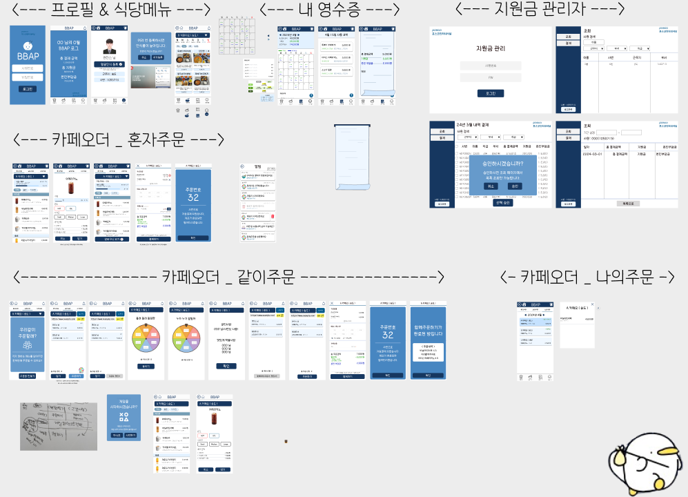</td>
        <td> 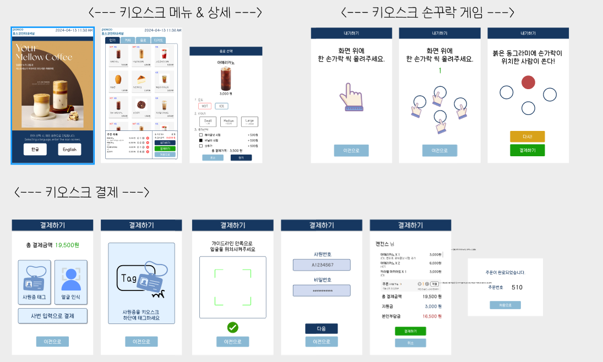</td>
    </tr>
</table>

<table>
    <tr align="center" > 
      <td><strong>DB ERD</strong></td>
      <td><strong>NoSQL ERD</strong></td>
      <td><strong>아키텍처</strong></td>
    </tr>
    <tr align="center">
        <td> 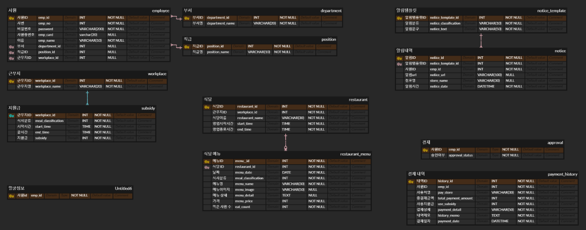</td>
                <td> 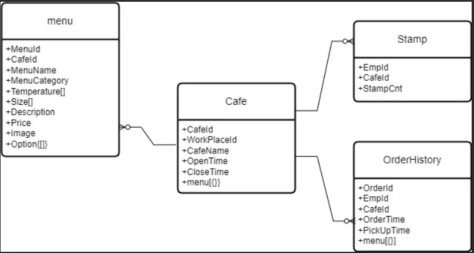</td>
        <td> 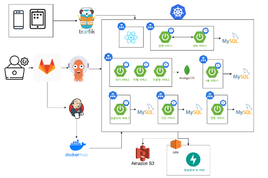</td>
    </tr>
</table>

<table>
    <tr align="center" > 
      <td><strong>API 명세서</strong></td>
      <td><strong>기능 명세서</strong></td>
    </tr>
    <tr align="center">
        <td> 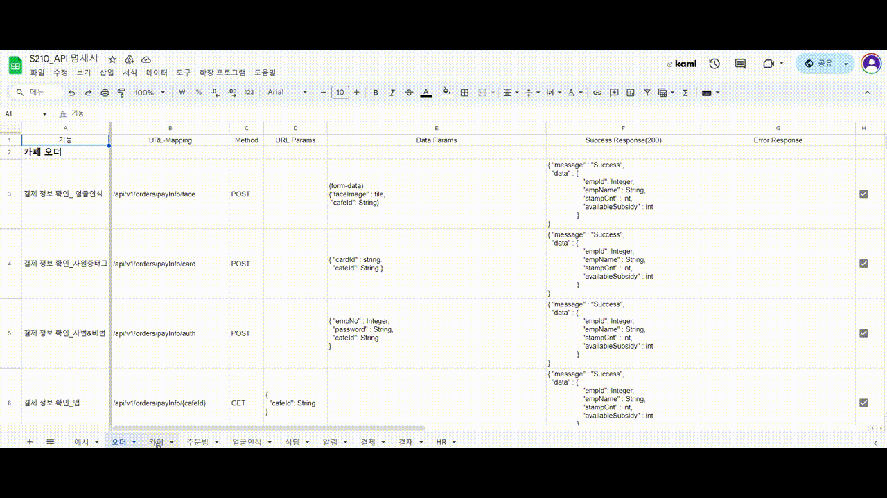</td>
        <td> 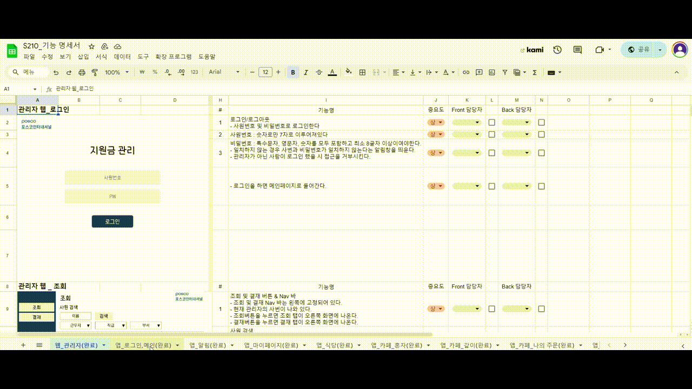</td>
    </tr>
</table>
<br>

## 🧾컴포넌트

### FE

<details>
<summary>Front-End</summary>
<div markdown="1">

- App

```
┗📦src
 ┣ 📂components
 ┃ ┣ 📂admin
 ┃ ┃ ┣ 📜 approval.css
 ┃ ┃ ┣ 📜 approval.tsx
 ┃ ┃ ┣ 📜 datailpagination.tsx
 ┃ ┃ ┣ 📜 employeesubsidy.tsx
 ┃ ┃ ┣ 📜 filter.tsx
 ┃ ┃ ┣ 📜 Pagination.tsx
 ┃ ┣ 📂cafe
 ┃ ┃ ┣ 📜 CafeCoupon.tsx
 ┃ ┃ ┣ 📜 CafeNameInfo.tsx
 ┃ ┃ ┣ 📜 CafeSelector.tsx
 ┃ ┃ ┣ 📜 CafeTabs.tsx
 ┃ ┃ ┣ 📜 Coupon.tsx
 ┃ ┃ ┣ 📜 CreateRoomModal.tsx
 ┃ ┃ ┣ 📜 DetailModal.tsx
 ┃ ┃ ┣ 📜 GameModal.tsx
 ┃ ┃ ┣ 📜 MenuButtons.tsx
 ┃ ┃ ┣ 📜 MenuSection.tsx
 ┃ ┃ ┣ 📜 Modal.tsx
 ┃ ┃ ┣ 📜 MonthNavigation.tsx
 ┃ ┃ ┣ 📜 OrderCard.tsx
 ┃ ┃ ┣ 📜 OrderList.tsx
 ┃ ┃ ┣ 📜 TogetherMenuSection.tsx
 ┃ ┣ 📂calendar
 ┃ ┃ ┣ 📜 _common.scss
 ┃ ┃ ┣ 📜 _style.scss
 ┃ ┃ ┣ 📜 _theme.scss
 ┃ ┃ ┣ 📜 CalenderComponent.tsx
 ┃ ┃ ┣ 📜 filter.tsx
 ┃ ┃ ┣ 📜 Pagination.tsx
 ┃ ┣ 📂receipt
 ┃ ┃ ┣ 📜 Header.tsx
 ┃ ┃ ┣ 📜 PaymentCard.tsx
 ┃ ┃ ┣ 📜 PaymentSummary.tsx
 ┃ ┃ ┣ 📜 ReceiptHeader.tsx
 ┃ ┃ ┣ 📜 Summary.tsx
 ┃ ┣ 📂 restaurant
 ┃ ┃ ┣ 📜 DateNavigation.tsx
 ┃ ┃ ┣ 📜 MealTypeSelector.tsx
 ┃ ┃ ┣ 📜 MenuCard.tsx
 ┃ ┃ ┣ 📜 RestaurantSelector.tsx
 ┃ ┣ 📂users
 ┃ ┃ ┣ 📜 Modal.tsx
 ┃ ┃ ┣ 📜 FaceRecognitionButton.tsx
 ┃ ┃ ┣ 📜 ProfileCard.tsx
 ┃ ┣ 📜 BottomTabBar.tsx
 ┃ ┣ 📜 button.tsx
 ┃ ┣ 📜 install.tsx
 ┃ ┣ 📜 Loading.tsx
 ┃ ┣ 📜 Navbar.tsx
 ┃ ┣ 📜 nodata.tsx
 ┃ ┣ 📜 NoticeItem.tsx
 ┣ 📂pages
 ┃ ┣ 📂	admin
 ┃ ┃ ┣ 📜AdminLoginPage.tsx
 ┃ ┃ ┣ 📜AdminPage.tsx
 ┃ ┃ ┣ 📜PeriodInquiryPage.tsx
 ┃ ┣ 📂cafe
 ┃ ┃ ┣ 📂aloneorder
 ┃ ┃ ┃ ┣ 📜AloneOrderPage .tsx
 ┃ ┃ ┣ 📂myorder
 ┃ ┃ ┃ ┣ 📜MyOrderPage.tsx
 ┃ ┃ ┣ 📂togetherorder
 ┃ ┃ ┃ ┣ 📜RoulettePage.tsx
 ┃ ┃ ┃ ┣ 📜TogetherAfterPaymentPage.tsx
 ┃ ┃ ┃ ┣ 📜TogetherCreateRoomPage.tsx
 ┃ ┃ ┃ ┣ 📜TogetherMenuDetailPage.tsx
 ┃ ┃ ┃ ┣ 📜TogetherMenuSelectorPage.tsx
 ┃ ┃ ┃ ┣ 📜TogetherOrderPage.tsx
 ┃ ┃ ┃ ┣ 📜TogetherPayment.tsx
 ┃ ┃ ┃ ┣ 📜WinnerPage.tsx
 ┃ ┃ ┣ 📜AfterPaymentPage.tsx
 ┃ ┃ ┣ 📜CafeMainPage.tsx
 ┃ ┃ ┣ 📜CartPage.tsx
 ┃ ┃ ┣ 📜MenuDetailPage.tsx
 ┃ ┣ 📂	users
 ┃ ┃ ┣ 📜LoginPage.tsx
 ┃ ┃ ┣ 📜MainPage.tsx
 ┃ ┃ ┣ 📜MyProfilePage.tsx
 ┃ ┣ 📜NotificationPage.tsx
 ┃ ┣ 📜RestaurantMainPage.tsx
 ┣ 📂store
 ┃ ┣ 📜 cafeStore.tsx
 ┃ ┣ 📜 cartStore.tsx
 ┃ ┣ 📜 contentStore.tsx
 ┃ ┣ 📜 noticeStore.tsx
 ┃ ┣ 📜 roomStore.tsx
 ┃ ┣ 📜 userStore.tsx
 ┣ 📜App.tsx
 ┗ 📜main.tsx
```

- kiosk

```
┗📦src
 ┣ 📂components
 ┃ ┣ 📜 button.tsx
 ┃ ┣ 📜 cartItem.tsx
 ┃ ┣ 📜 confirmModal.tsx
 ┃ ┣ 📜 coupon.tsx
 ┃ ┣ 📜 currentTime.tsx
 ┃ ┣ 📜 customKeyboard.css
 ┃ ┣ 📜 customKeyboard.tsx
 ┃ ┣ 📜 entryCarousel.tsx
 ┃ ┣ 📜 install.tsx
 ┃ ┣ 📜 menuItem.tsx
 ┃ ┣ 📜 MenuModal.tsx
 ┣ 📂pages
 ┃ ┣ 📂	admin
 ┃ ┃ ┣ 📜 paymentFacePage.tsx
 ┃ ┃ ┣ 📜 paymentFinalPage.tsx
 ┃ ┃ ┣ 📜 paymentLoginPage.tsx
 ┃ ┃ ┣ 📜 paymentPage.tsx
 ┃ ┃ ┣ 📜 paymentTagPage.tsx
 ┃ ┣ 📜entryPage.tsx
 ┃ ┣ 📜gamePage.tsx
 ┃ ┣ 📜mainPage.tsx
 ┃ ┣ 📜restaurantPage.tsx
 ┣ 📂store
 ┃ ┣ 📜 cartStore.tsx
 ┃ ┣ 📜 modalStore.tsx
 ┣ 📜App.tsx
 ┗ 📜main.tsx
```

</div>
</details>

## ✅ 팀원소개
